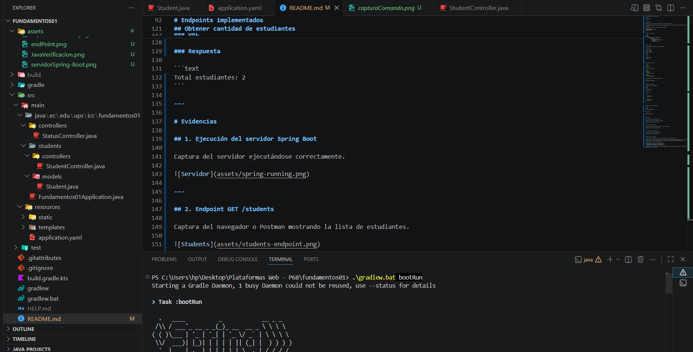
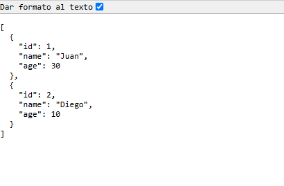
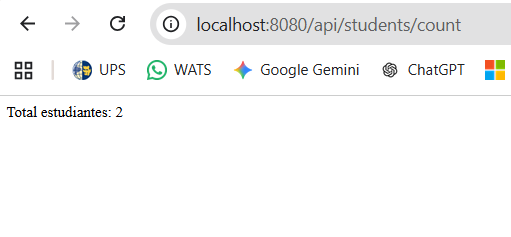

# API de Estudiantes con Spring Boot

## Autor

**Josué Abad**

mkdir controllers/
mkdir services/
mkdir repositories/
mkdir entities/
mkdir dtos/
mkdir mappers/
mkdir utils/

---

# Introducción

En esta práctica se desarrolló una API REST básica utilizando Spring Boot.

La aplicación permite consultar una lista de estudiantes almacenados en memoria y obtener la cantidad total de estudiantes registrados.

Se utilizó la arquitectura básica de Spring Boot mediante:

* Modelos (Model)
* Controladores (Controller)
* Endpoints REST

---

# Estructura del proyecto

```text
src/
└── main/
    └── java/
        └── ec/edu/ups/icc/fundamentos01/
            └── students/
                ├── controllers/
                │   └── StudentController.java
                └── models/
                    └── Student.java
```

---

# Modelo Student

La clase `Student` representa la entidad estudiante.

### Atributos

| Campo | Tipo   |
| ----- | ------ |
| id    | Long   |
| name  | String |
| age   | int    |

Ejemplo:

```json
{
  "id": 1,
  "name": "Juan",
  "age": 30
}
```

---

# Configuración de la API

Archivo:

```yaml
application.yml
```

Configuración utilizada:

```yaml
server:
  port: 8080
  servlet:
    context-path: /api

spring:
  application:
    name: fundamentos01
```

Esto significa que la aplicación se ejecuta en:

```text
http://localhost:8080/api
```

---

# Endpoints implementados

## Obtener todos los estudiantes

### URL

```http
GET /api/students
```

### Respuesta

```json
[
  {
    "id": 1,
    "name": "Juan",
    "age": 30
  },
  {
    "id": 2,
    "name": "Diego",
    "age": 10
  }
]
```

---

## Obtener cantidad de estudiantes

### URL

```http
GET /api/students/count
```

### Respuesta

```text
Total estudiantes: 2
```

---

# Evidencias

## 1. Ejecución del servidor Spring Boot

Captura del servidor ejecutándose correctamente.



---

## 2. Endpoint GET /students

Captura del navegador o Postman mostrando la lista de estudiantes.



---

## 3. Endpoint GET /students/count

Captura mostrando el total de estudiantes.



---

# Explicación 

Durante esta práctica aprendí cómo crear una API REST básica utilizando Spring Boot.

La clase `Student` funciona como modelo de datos y representa la información de cada estudiante. El controlador `StudentController` expone endpoints HTTP que permiten consultar la información almacenada en memoria.

También comprendí el uso de las anotaciones:

* `@RestController` para crear controladores REST.
* `@RequestMapping` para definir una ruta base.
* `@GetMapping` para responder solicitudes HTTP GET.

Además, observé cómo Spring Boot convierte automáticamente los objetos Java en respuestas JSON, facilitando la creación de APIs para aplicaciones web y móviles.
