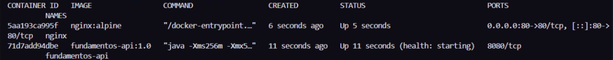
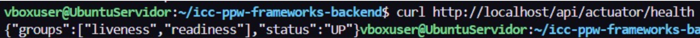
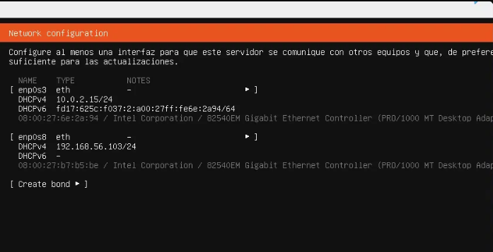
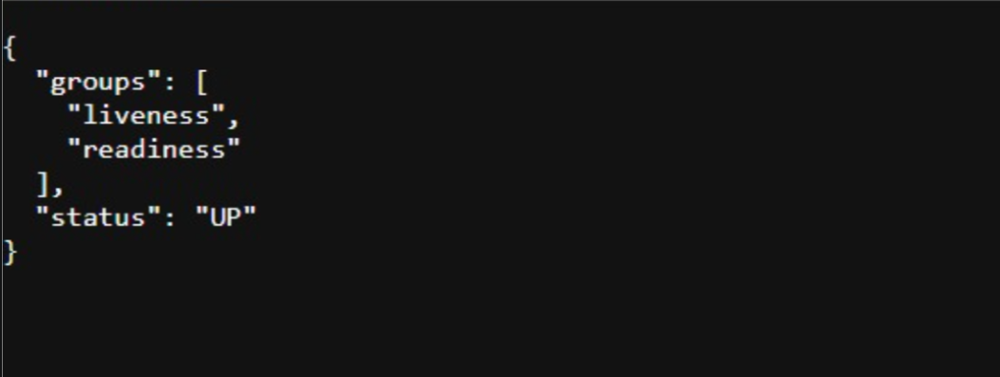

# Práctica 16: Despliegue portable de Spring Boot con Docker y Nginx en Ubuntu Server

## 1. Tema

Frameworks Backend: Spring Boot – Despliegue portable con Docker, Nginx y PostgreSQL externo sobre Ubuntu Server.

El objetivo de esta práctica fue preparar la API para que la misma imagen Docker pudiera ejecutarse en distintos ambientes (desarrollo local, Ubuntu Server, y potencialmente un PaaS como Render) sin modificar el código ni reconstruir la imagen por cada entorno. La configuración específica de cada ambiente se entrega mediante variables de entorno, no mediante código hardcodeado.

---

## 2. Arquitectura

```text
HOST anfitrión (Windows)
├── Código fuente e IDE
├── PostgreSQL de desarrollo: 192.168.56.1:5432
└── Red Host-Only de VirtualBox
             │
             │ 192.168.56.0/24
             ▼
Ubuntu Server: 192.168.56.103
├── Docker Engine
├── Contenedor Spring Boot (fundamentos-api)
└── Contenedor Nginx
```

Flujo HTTP final:

```text
HOST → http://192.168.56.103/api/... → Nginx:80 → fundamentos-api:8080 → PostgreSQL
```

---

## 3. Configuración por ambientes

Se dividió la configuración en tres archivos:

```text
src/main/resources/
├── application.yaml        ← configuración común (nombre de app, Actuator, Swagger)
├── application-dev.yaml    ← valores por defecto para desarrollo local
└── application-prod.yaml   ← exige variables de entorno, sin valores por defecto
```

`application-prod.yaml` no tiene valores predeterminados para URL de base de datos, credenciales, secreto JWT, puerto ni nivel de logging: si una variable obligatoria no está definida, la aplicación falla al arrancar. Esto evita desplegar por error una instancia de producción con credenciales de desarrollo.

---

## 4. Cambios en `build.gradle.kts`

- Se agregó `spring-boot-starter-actuator` para exponer `/actuator/health`.
- Se fijó el nombre del artefacto generado:
```kotlin
  tasks.bootJar {
      archiveFileName.set("app.jar")
  }
  tasks.jar {
      enabled = false
  }
```

---

## 5. `Dockerfile` multi-stage con capas separadas

Se usó un Dockerfile de dos etapas:

1. **`builder`**: compila con JDK y Gradle Wrapper, y descomprime el JAR generado para separar `BOOT-INF/lib` (dependencias) de `BOOT-INF/classes` (código propio).
2. **`runtime`**: copia esas capas por separado en una imagen liviana con solo el JRE, corriendo con un usuario no-root (`spring`).

Separar dependencias de clases permite que, cuando solo cambia el código (no las dependencias), Docker reutilice la capa de dependencias en reconstrucciones posteriores, acelerando el build.

Se agregó también un `HEALTHCHECK` que consulta `/api/actuator/health` cada 30 segundos, usado por Docker para reportar el estado del contenedor.

---

## 6. Variables de entorno

### `.env.dev` (local, no versionado)
Usado para correr la app localmente con el perfil `dev`.

### `.env.ubuntu` (dentro de la VM, no versionado)
Usado para correr el contenedor en Ubuntu Server con el perfil `prod`, apuntando al PostgreSQL del host anfitrión mediante la IP de la red Host-Only:

```dotenv
DATABASE_URL=jdbc:postgresql://192.168.56.1:5432/devdb
```

### `.env.example` (sí versionado)
Plantilla sin secretos, como referencia de qué variables necesita el proyecto.

Ninguno de los archivos `.env*` reales se sube al repositorio (`.gitignore` los excluye explícitamente, salvo `.env.example`).

---

## 7. Preparación de la VM Ubuntu Server

- Se creó una red **Host-Only** en VirtualBox (`192.168.56.0/24`).
- La VM se configuró con **dos adaptadores de red**: uno NAT (para acceso a internet, `apt`, `git clone`) y otro Host-Only (para comunicarse con el host anfitrión).
- Se instaló Ubuntu Server (LTS), con OpenSSH habilitado durante la instalación para poder administrar la VM por SSH desde Windows en lugar de usar la consola de VirtualBox.
- IP asignada a la VM en la red Host-Only: `192.168.56.103`
- Se instaló Docker Engine dentro de la VM y se creó la red interna `app-network` para conectar los contenedores de la aplicación entre sí.

---

## 8. Despliegue de la aplicación en Ubuntu Server

Se clonó el repositorio dentro de la VM y se construyó la imagen con el `Dockerfile` multi-stage descrito en la sección 5:

```bash
docker build --pull -t fundamentos-api:1.0 .
```

El contenedor de la API se ejecutó conectado a la red `app-network`, recibiendo la configuración mediante `--env-file .env.ubuntu`, sin publicar directamente el puerto 8080 al exterior:

```bash
docker run -d \
  --name fundamentos-api \
  --network app-network \
  --env-file .env.ubuntu \
  fundamentos-api:1.0
```

Se levantó un contenedor de **Nginx** como reverse proxy, publicado en el puerto 80, redirigiendo las peticiones a `fundamentos-api:8080` mediante resolución DNS interna de Docker:

```bash
docker run -d \
  --name nginx \
  --network app-network \
  -p 80:80 \
  -v "$(pwd)/nginx/default.conf:/etc/nginx/conf.d/default.conf:ro" \
  nginx:alpine
```

De esta forma, la API queda accesible únicamente a través de Nginx (`puerto 80`), mientras que el puerto 8080 de Spring Boot permanece privado dentro de la red interna de Docker.

---

## 9. Pruebas realizadas

| # | Prueba | Comando | Resultado esperado | Resultado obtenido |
|---|--------|---------|---------------------|----------------------|
| 1 | Contenedores corriendo en Ubuntu | `docker ps` | `nginx` y `fundamentos-api` en estado `Up` 
| 2 | Health check desde Ubuntu Server | `curl http://localhost/api/actuator/health` | `{"status":"UP"}` 
| 3 | Health check desde la máquina anfitriona | `http://192.168.56.103/api/actuator/health` | `{"status":"UP"}` 

---

## 10. Evidencias









---