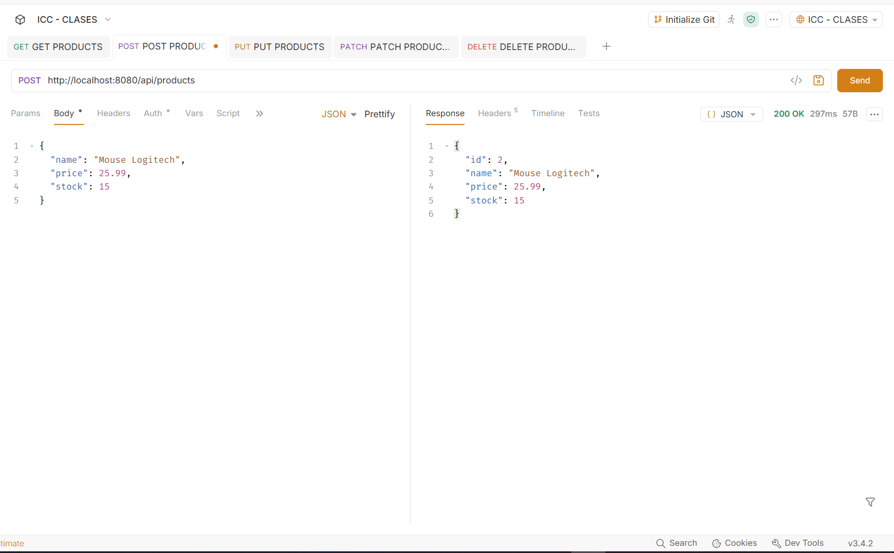

# Fundamentos01

Proyecto desarrollado en Spring Boot con PostgreSQL y Docker para la gestión de usuarios y productos.

## Tecnologías utilizadas

- Java 17
- Spring Boot
- Spring Data JPA
- PostgreSQL 16
- Docker
- Gradle
- Bruno

---

# Configuración de PostgreSQL

## Crear volumen

```bash
docker volume create pgdata
```

## Descargar imagen

```bash
docker pull postgres:16
```

## Crear contenedor

```bash
docker run -d ^
--name postgres-dev ^
-e POSTGRES_USER=ups ^
-e POSTGRES_PASSWORD=ups123 ^
-e POSTGRES_DB=devdb ^
-p 5432:5432 ^
-v pgdata:/var/lib/postgresql/data ^
postgres:16
```

## Verificar contenedor

```bash
docker ps
```

## Acceder a PostgreSQL

```bash
docker exec -it postgres-dev psql -U ups -d devdb
```

---

# Configuración Spring Boot

```yaml
spring:
  datasource:
    url: jdbc:postgresql://localhost:5432/devdb
    username: ups
    password: ups123

  jpa:
    hibernate:
      ddl-auto: update
    show-sql: true
```

---

# Módulo Users

## Validaciones implementadas

- Nombre obligatorio
- Nombre entre 3 y 150 caracteres
- Email obligatorio
- Email con formato válido
- Email único
- Contraseña obligatoria
- Contraseña mínima de 8 caracteres

## Reglas de negocio

- No permite correos duplicados
- No devuelve usuarios eliminados
- No permite eliminar dos veces el mismo usuario
- No permite actualizar usuarios eliminados

---

# Módulo Products

## Validaciones implementadas

- Nombre obligatorio
- Nombre entre 3 y 150 caracteres
- Precio obligatorio
- Precio mayor o igual a 0
- Stock obligatorio
- Stock mayor o igual a 0

## Reglas de negocio

- No devuelve productos eliminados
- No permite actualizar productos eliminados
- No permite eliminar dos veces el mismo producto

---

# Evidencias


## CRUD de Products

### Crear producto



### Obtener productos


---


# Conclusiones

- Se implementó persistencia utilizando Spring Data JPA y PostgreSQL.
- Se validaron los datos de entrada mediante Jakarta Validation.
- Se aplicaron reglas de negocio para usuarios y productos.
- Se comprobó la integración entre Spring Boot, PostgreSQL y Docker.
- Se verificó el funcionamiento de los endpoints mediante Bruno.