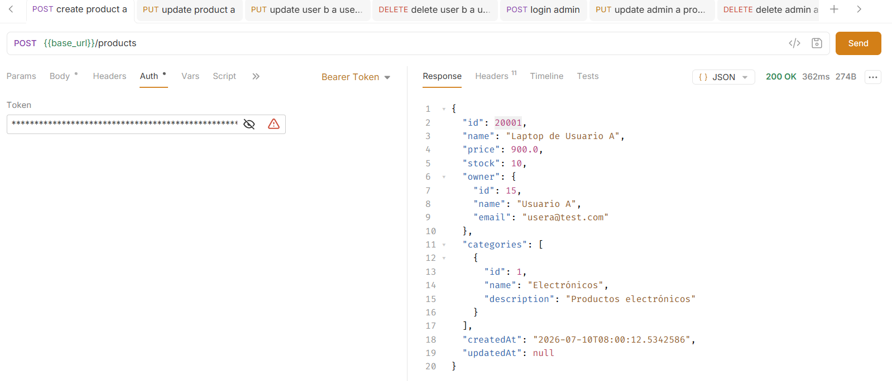
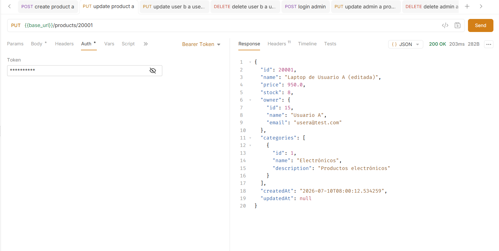
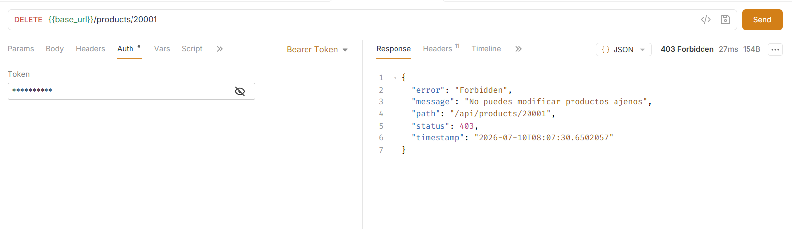
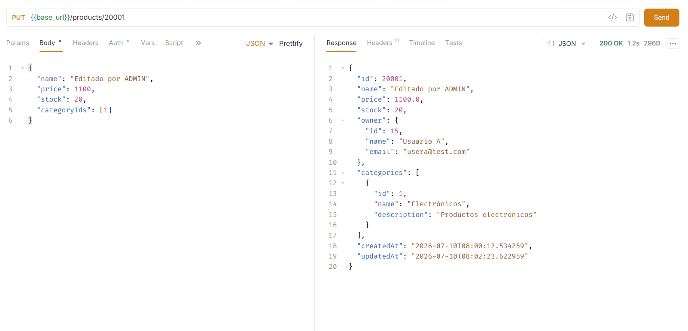

# Práctica 13: Validación de Ownership

## 1. Tema

Frameworks Backend: Spring Boot – Validación de propiedad de recursos (*ownership*).

En la Práctica 11 se resolvió *¿quién eres?* (autenticación con JWT) y en la Práctica 12 *¿qué rol tienes?* (autorización con `@PreAuthorize`). En esta práctica se resuelve una tercera pregunta: **¿este recurso te pertenece?**

Hasta este punto, cualquier usuario autenticado podía modificar o eliminar productos de otros usuarios simplemente teniendo un token válido, sin importar quién era el dueño real del recurso.

---

## 2. Objetivo

- Que un usuario con `ROLE_USER` solo pueda editar o eliminar **sus propios** productos.
- Que un usuario con `ROLE_ADMIN` pueda editar o eliminar **cualquier** producto (bypass de ownership).
- Que el `owner` de un producto se determine **desde el token JWT**, nunca desde un campo enviado por el cliente.

---

## 3. Problema de seguridad corregido: `userId` en el body

Antes de esta práctica, `CreateProductDto` incluía un campo `userId` enviado por el cliente:

```json
{
  "name": "Laptop",
  "price": 900,
  "stock": 10,
  "userId": 5,
  "categoryIds": [1, 2]
}
```

Esto permitía que un usuario autenticado con `id = 2` creara productos a nombre de otro usuario (`id = 5`), simplemente cambiando ese valor en el body. Se eliminó el campo `userId` de `CreateProductDto`: ahora **el owner del producto siempre es el usuario autenticado**, extraído del JWT.

---

## 4. Cambios realizados

### 4.1. `CreateProductDto`
Se eliminó el campo `userId` (validación, getter, setter y constructor actualizados).

### 4.2. `UserRepository`
Se agregó:
```java
Optional<UserEntity> findByIdAndDeletedFalse(Long id);
```
Usado para reconvertir el `UserDetailsImpl` del token en una entidad `UserEntity` persistente, verificando que el usuario siga existiendo y no esté eliminado lógicamente.

### 4.3. `ProductService` (interfaz)
Los métodos que modifican datos ahora reciben el usuario autenticado:

```java
ProductResponseDto create(CreateProductDto dto, UserDetailsImpl currentUser);
ProductResponseDto update(Long id, UpdateProductDto dto, UserDetailsImpl currentUser);
ProductResponseDto partialUpdate(Long id, PartialUpdateProductDto dto, UserDetailsImpl currentUser);
void delete(Long id, UserDetailsImpl currentUser);
```

### 4.4. `ProductsController`
Los endpoints `create`, `update`, `partialUpdate` y `delete` extraen el usuario autenticado con `@AuthenticationPrincipal`:

```java
@PostMapping
public ProductResponseDto create(
        @Valid @RequestBody CreateProductDto dto,
        @AuthenticationPrincipal UserDetailsImpl currentUser
) {
    return service.create(dto, currentUser);
}
```

El resto de endpoints (consultas, `findAll` con `@PreAuthorize("hasRole('ADMIN')")` de la Práctica 12) no cambiaron.

### 4.5. `ProductServiceImpl` — lógica de ownership

En `create()`, el owner ya no sale de `dto.getUserId()`, sino del usuario autenticado:

```java
UserEntity owner = findCurrentUserEntity(currentUser);
```

En `update()`, `partialUpdate()` y `delete()`, se agregó la validación justo después de buscar el producto:

```java
ProductEntity entity = productRepository.findByIdAndDeletedFalse(id)
        .orElseThrow(() -> new NotFoundException("Product not found"));

validateOwnership(entity, currentUser);
```

Se agregaron 3 métodos privados:

```java
private UserEntity findCurrentUserEntity(UserDetailsImpl currentUser) {
    if (currentUser == null) {
        throw new AccessDeniedException("Usuario no autenticado");
    }
    return userRepository.findByIdAndDeletedFalse(currentUser.getId())
            .orElseThrow(() -> new AccessDeniedException("Usuario no autorizado"));
}

private void validateOwnership(ProductEntity product, UserDetailsImpl currentUser) {
    if (currentUser == null) {
        throw new AccessDeniedException("Usuario no autenticado");
    }

    if (hasRole(currentUser, "ROLE_ADMIN")) {
        return; // ADMIN se salta la validación de ownership
    }

    if (product.getOwner() == null || product.getOwner().getId() == null) {
        throw new AccessDeniedException("El producto no tiene propietario válido");
    }

    if (!product.getOwner().getId().equals(currentUser.getId())) {
        throw new AccessDeniedException("No puedes modificar productos ajenos");
    }
}

private boolean hasRole(UserDetailsImpl user, String role) {
    return user.getAuthorities()
            .stream()
            .map(GrantedAuthority::getAuthority)
            .anyMatch(authority -> authority.equals(role));
}
```

### 4.6. `GlobalExceptionHandler`
El manejador de `AccessDeniedException` (creado en la Práctica 12) se ajustó para mostrar el mensaje real de la excepción en lugar de un texto genérico fijo:

```java
@ExceptionHandler(AccessDeniedException.class)
public ResponseEntity<ErrorResponse> handleAccessDeniedException(
        AccessDeniedException ex,
        HttpServletRequest request
) {
    String message = ex.getMessage();

    if (message == null || message.isBlank()) {
        message = "Acceso denegado";
    }

    ErrorResponse response = new ErrorResponse(
            HttpStatus.FORBIDDEN,
            message,
            request.getRequestURI()
    );

    return ResponseEntity.status(HttpStatus.FORBIDDEN).body(response);
}
```

---

## 5. Flujo de validación

```txt
PUT /api/products/{id}
Authorization: Bearer <token>
        ↓
JwtAuthenticationFilter valida el token
        ↓
SecurityContext contiene UserDetailsImpl
        ↓
ProductsController.update()
        ↓
@AuthenticationPrincipal currentUser
        ↓
ProductServiceImpl.update(id, dto, currentUser)
        ↓
findByIdAndDeletedFalse(id) → producto encontrado
        ↓
validateOwnership(producto, currentUser)
   ├── ¿currentUser tiene ROLE_ADMIN? → SÍ → permite
   └── ¿currentUser es el owner?
         ├── SÍ → permite
         └── NO → AccessDeniedException → 403 Forbidden
```

---

## 6. Diferencia entre los 3 niveles de seguridad

| Caso | Validación | Dónde ocurre | Código |
|------|-------------|---------------|--------|
| Sin token / token inválido | Autenticación | `JwtAuthenticationEntryPoint` | `401 Unauthorized` |
| Token válido, sin el rol requerido | Autorización por rol | `@PreAuthorize` | `403 Forbidden` |
| Token válido, recurso ajeno | Ownership | `ProductServiceImpl.validateOwnership()` | `403 Forbidden` |

---

## 7. Pruebas realizadas (Bruno)

Se registraron dos usuarios (`Usuario A` y `Usuario B`) y se asignó `ROLE_ADMIN` a un tercero mediante SQL:

```sql
INSERT INTO user_roles (user_id, role_id)
SELECT <id_usuario>, r.id
FROM roles r
WHERE r.name = 'ROLE_ADMIN';
```

> Los roles quedan incluidos en el JWT en el momento en que se genera, por lo que tras asignar `ROLE_ADMIN` es obligatorio volver a iniciar sesión con ese usuario para obtener un token actualizado.

| # | Escenario | Endpoint | Resultado esperado | Resultado obtenido |
|---|-----------|----------|---------------------|---------------------|
| 1 | Usuario A crea un producto (sin `userId` en el body) | `POST /api/products` | `200/201`, `owner` = Usuario A | ✅ |
| 2 | Usuario A edita su propio producto | `PUT /api/products/{id}` | `200 OK` | ✅ |
| 3 | Usuario B edita el producto de Usuario A | `PUT /api/products/{id}` | `403 Forbidden` – "No puedes modificar productos ajenos" | ✅ |
| 4 | Usuario B elimina el producto de Usuario A | `DELETE /api/products/{id}` | `403 Forbidden` | ✅ |
| 5 | ADMIN edita el producto de Usuario A | `PUT /api/products/{id}` | `200 OK` | ✅ |
| 6 | ADMIN elimina el producto de Usuario A | `DELETE /api/products/{id}` | `200 OK` | ✅ |






---

## 8. Preguntas de la actividad

**¿Qué es ownership?**

Ownership (propiedad) es la relación entre un recurso y el usuario al que pertenece. En este proyecto, cada producto tiene un `owner` (el usuario que lo creó), y la regla de negocio establece que solo ese usuario —o un `ADMIN`— puede modificarlo o eliminarlo. Es un nivel de seguridad adicional a la autenticación y a los roles: no basta con estar identificado y tener el rol correcto, también hace falta ser el dueño del recurso específico sobre el que se actúa.

**¿Por qué no es seguro recibir `userId` en `CreateProductDto`?**

Porque el cliente podría enviar cualquier `userId`, incluso uno que no le corresponde, y el servidor lo aceptaría sin verificar que coincida con el usuario autenticado. Esto permitiría crear recursos a nombre de otra persona. La solución correcta es obtener siempre el ID del usuario desde el JWT ya validado (`@AuthenticationPrincipal`), que es información que el propio servidor generó y firmó, y que el cliente no puede falsificar.

**¿Cuál es la diferencia entre autorización por rol y autorización por ownership?**

La autorización por rol (`@PreAuthorize("hasRole('ADMIN')")`) responde *¿qué tipo de usuario eres?* y se evalúa de forma estática antes de ejecutar el método, sin mirar los datos del recurso solicitado. La autorización por ownership responde *¿este recurso específico te pertenece?* y necesita cargar primero el recurso de la base de datos para comparar su propietario con el usuario autenticado — por eso se implementa dentro del servicio y no como una anotación en el controlador.

---

