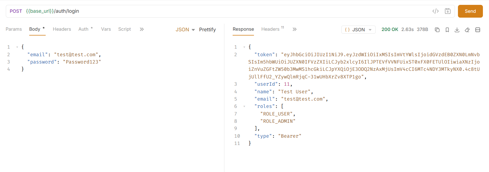
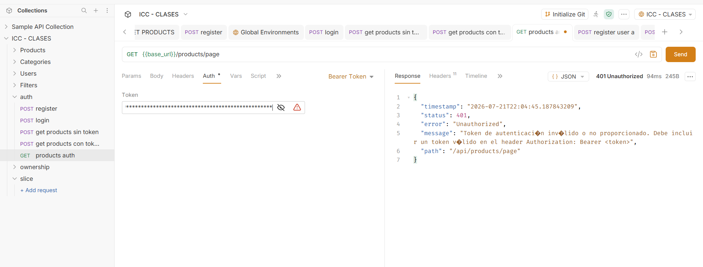
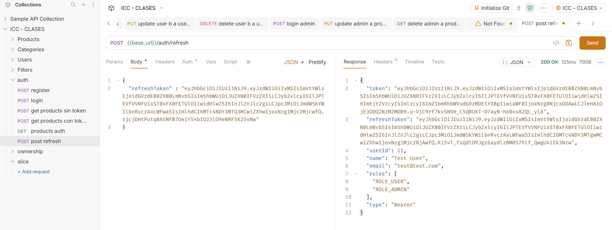
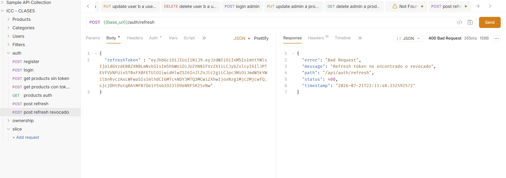
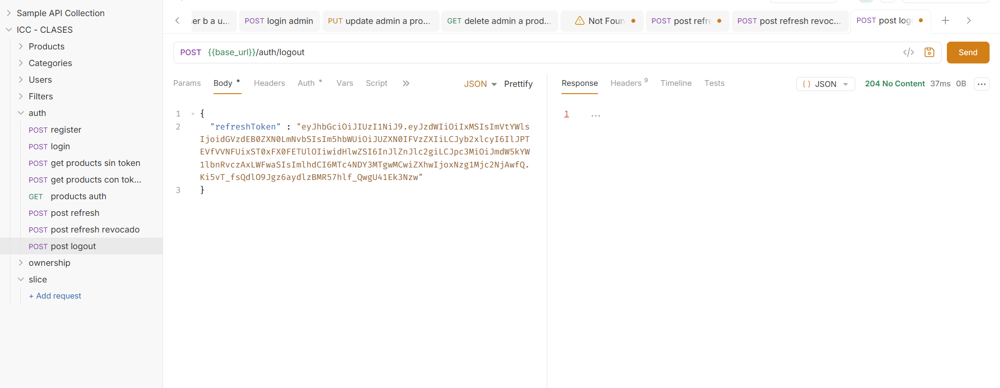
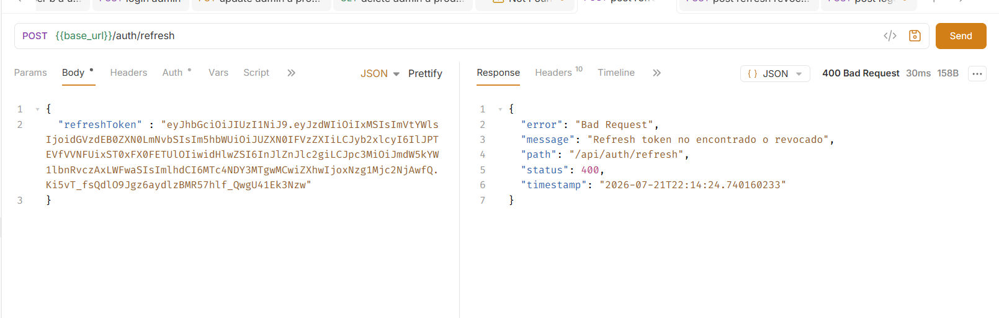

# Práctica 16: Refresh Token con JWT

## 1. Tema

Frameworks Backend: Spring Boot – Renovación de Access Token mediante Refresh Token.

En las prácticas anteriores se implementó autenticación (JWT), autorización por rol (`@PreAuthorize`) y autorización por ownership. Sin embargo, el access token tiene una duración corta (30 minutos), y al expirar el usuario debía volver a iniciar sesión desde cero. En esta práctica se implementó un mecanismo de refresh token para renovar la sesión sin pedir credenciales de nuevo.

---

## 2. Problema resuelto

Antes de esta práctica:
GET /api/products/page
Authorization: Bearer <access-token-expirado>
→ 401 Unauthorized

El usuario debía volver a hacer login. Ahora, en su lugar, puede usar un refresh token de larga duración para obtener un access token nuevo sin reingresar su contraseña.

---

## 3. Diferencia entre Access Token y Refresh Token

| Aspecto | Access Token | Refresh Token |
|---------|---------------|-----------------|
| Uso | Acceder a endpoints protegidos | Renovar el access token |
| Duración | Corta (30 minutos) | Larga (7 días) |
| Dónde viaja | Header `Authorization: Bearer` | Body de `/auth/refresh` |
| Se usa en cada request | Sí | No |
| Se guarda en base de datos | No | Sí |

Ambos tokens llevan un claim adicional `type` (`"access"` o `"refresh"`) para que el backend pueda distinguirlos y rechazar un refresh token si se intenta usar como access token.

---

## 4. Cambios realizados

### 4.1. `RefreshTokenEntity` (nueva)
Entidad JPA que representa un refresh token emitido, guardada en la tabla `refresh_tokens`. Incluye: usuario dueño, el token, fecha de expiración y un flag `revoked`.

### 4.2. `RefreshTokenRepository` (nuevo)
```java
Optional<RefreshTokenEntity> findByTokenAndRevokedFalse(String token);
List<RefreshTokenEntity> findByUserIdAndRevokedFalse(Long userId);
```

### 4.3. `RefreshTokenRequestDto` (nuevo)
DTO usado en `/auth/refresh` y `/auth/logout` para recibir el refresh token del cliente.

### 4.4. `AuthResponseDto`
Se agregó el campo `refreshToken`, devuelto junto al `token` (access token) en login, register y refresh.

### 4.5. `JwtUtil`
Se agregó un claim `type` (`access` / `refresh`) a cada token generado, y métodos separados:

```java
generateAccessToken(...)
generateAccessTokenFromUserDetails(...)
generateRefreshToken(...)
validateAccessToken(...)   // válido solo si type = access
validateRefreshToken(...)  // válido solo si type = refresh
getTokenType(...)
```

### 4.6. `JwtAuthenticationFilter`
Se cambió la validación de:
```java
jwtUtil.validateToken(jwt)
```
a:
```java
jwtUtil.validateAccessToken(jwt)
```
Esto asegura que un refresh token nunca sea aceptado como Bearer token en un endpoint protegido.

### 4.7. `RefreshTokenService` (nuevo)
Servicio que centraliza la lógica de refresh tokens:

- `createRefreshToken(...)`: genera y guarda un refresh token.
- `validateAndGetActiveToken(...)`: valida firma, tipo, existencia en BD, expiración y que el usuario siga activo.
- `revoke(...)`: revoca un token específico (usado en logout y en rotación).
- `revokeAllByUser(...)`: revoca todos los tokens activos de un usuario (usado en login, para dejar una sola sesión activa).

### 4.8. `AuthService`
- `login()`: ahora también revoca refresh tokens anteriores del usuario y genera un refresh token nuevo junto al access token.
- `register()`: genera access token y refresh token al crear el usuario.
- `refresh()` (nuevo): valida el refresh token recibido, lo revoca (rotación) y genera un par nuevo de tokens.
- `logout()` (nuevo): revoca el refresh token recibido.

### 4.9. `AuthController`
Se agregaron dos endpoints:
POST /api/auth/refresh
POST /api/auth/logout

Ambos son públicos (`/auth/**` ya estaba permitido desde la Práctica 11), porque no se validan con access token sino con refresh token, verificado directamente en `RefreshTokenService`.

---

## 5. Rotación de refresh token

Cada vez que se usa un refresh token en `/auth/refresh`, ese token se revoca y se genera uno nuevo:
Login → accessToken A + refreshToken A
Refresh → refreshToken A se revoca → accessToken B + refreshToken B
Refresh → refreshToken B se revoca → accessToken C + refreshToken C

Esto evita que un mismo refresh token se reutilice indefinidamente, y limita el daño si un refresh token llega a ser robado: solo sirve una vez.

---

## 6. Pruebas realizadas (Bruno, sobre la app corriendo en Docker)

| # | Escenario | Endpoint | Resultado esperado | Resultado obtenido |
|---|-----------|----------|---------------------|---------------------|
| 1 | Login | `POST /api/auth/login` | `200 OK` con `token` y `refreshToken` | ✅ |
| 2 | Usar refresh token como access token | `GET /api/products/page` | `401 Unauthorized` | ✅ |
| 3 | Refresh exitoso | `POST /api/auth/refresh` | `200 OK` con tokens nuevos | ✅ |
| 4 | Reutilizar refresh token anterior (ya rotado) | `POST /api/auth/refresh` | `400 Bad Request` – "Refresh token no encontrado o revocado" | ✅ |
| 5 | Logout | `POST /api/auth/logout` | `204 No Content` | ✅ |
| 6 | Refresh después de logout | `POST /api/auth/refresh` | `400 Bad Request` | ✅ |








---

## 7. Preguntas de la actividad

**¿Cuál es la diferencia entre access token y refresh token?**

El access token es el que se envía en cada petición protegida (`Authorization: Bearer <token>`) y tiene una duración corta (30 minutos), para limitar el daño si es robado. El refresh token, en cambio, no se usa para acceder a recursos directamente: su único propósito es obtener un access token nuevo cuando el anterior expira, sin que el usuario tenga que volver a ingresar su contraseña. Dura mucho más (7 días) y se guarda en base de datos para poder revocarlo.

**¿Por qué el refresh token no debe usarse en `Authorization: Bearer`?**

Porque tiene un propósito distinto y un nivel de exposición distinto: si un refresh token se filtrara y se aceptara como access token, un atacante tendría acceso a la API por mucho más tiempo (días en vez de minutos) sin que el sistema pudiera diferenciarlo de un uso legítimo. Por eso cada token lleva un claim `type`, y `JwtAuthenticationFilter` solo acepta tokens con `type = access`; un refresh token usado como Bearer es rechazado con `401 Unauthorized`.

**¿Qué significa rotar un refresh token?**

Significa que cada vez que un refresh token se usa para renovar la sesión, ese token se invalida (revoca) inmediatamente y se entrega uno nuevo en su lugar. Así, un refresh token solo puede usarse una vez: si alguien intenta reutilizar uno ya usado (por ejemplo, porque fue robado y tanto el atacante como el usuario legítimo lo usan), el sistema lo rechaza, porque ya quedó marcado como revocado en la base de datos.

---


