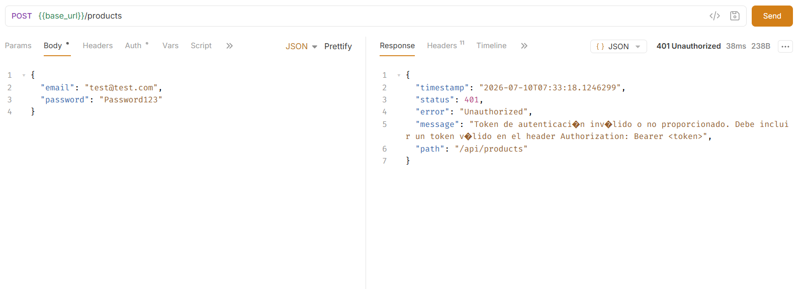
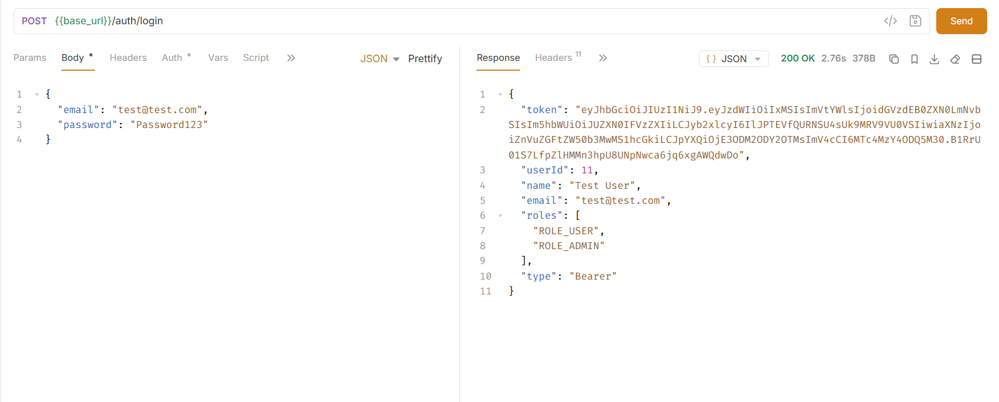

# Práctica 12: Roles y @PreAuthorize

## 1. Tema

Frameworks Backend: Spring Boot – Protección de endpoints por rol con `@PreAuthorize`.

En la Práctica 11 se implementó autenticación JWT: con `.anyRequest().authenticated()` en `SecurityConfig`, todos los endpoints (excepto `/auth/**`) ya exigían un token válido. Sin embargo, cualquier usuario autenticado —sin importar su rol— podía acceder a cualquier endpoint protegido.

En esta práctica se agregó una capa adicional de **autorización por rol**, restringiendo un endpoint sensible únicamente a usuarios con `ROLE_ADMIN`.

---

## 2. Objetivo

- Usar `@PreAuthorize` con expresiones de rol (`hasRole()`) para proteger un endpoint específico.
- Manejar correctamente las excepciones de autorización de Spring Security, devolviendo `403 Forbidden` en vez de `500 Internal Server Error`.
- Verificar el comportamiento con usuarios de distinto rol.

---

## 3. Prerrequisito

`SecurityConfig` ya contaba con `@EnableMethodSecurity(prePostEnabled = true)` desde la Práctica 11, por lo que no fue necesario modificar la configuración de seguridad global. Esto habilita el uso de `@PreAuthorize` en cualquier método de un `@RestController` o `@Service`.

---

## 4. Endpoint protegido

Se protegió únicamente el endpoint que lista **todos** los productos sin paginar, ya que expone datos de todos los usuarios sin ningún filtro:

Archivo: `products/controllers/ProductsController.java`

```java
import org.springframework.security.access.prepost.PreAuthorize;

// ...

/*
 * GET /api/products
 *
 * Solo ADMIN puede acceder: muestra todos los productos de todos los
 * usuarios sin paginación, exponiendo más información de la necesaria
 * para un usuario común.
 */
@GetMapping
@PreAuthorize("hasRole('ADMIN')")
public List<ProductResponseDto> findAll() {
    return service.findAll();
}
```

El resto de endpoints del controlador (`/products/page`, `/products/slice`, `/products/{id}`, `create`, `update`, `delete`, etc.) se mantuvieron sin cambios: siguen protegidos solo por autenticación (`.anyRequest().authenticated()`), accesibles para cualquier usuario logueado.

> **Nota:** `update()` y `delete()` no llevan `@PreAuthorize` porque la validación de *ownership* (propietario del recurso vs. ADMIN) se implementará en la Práctica 13, directamente en la capa de servicio.

---

## 5. Manejo de excepciones de autorización

Por defecto, cuando `@PreAuthorize` deniega el acceso, Spring Security lanza `AuthorizationDeniedException`. Sin un manejador específico, esto se traduce en `500 Internal Server Error` en vez del esperado `403 Forbidden`.

Se agregaron dos manejadores en `GlobalExceptionHandler.java`:

```java
import org.springframework.security.access.AccessDeniedException;
import org.springframework.security.authorization.AuthorizationDeniedException;

/*
 * Se lanza cuando @PreAuthorize evalúa a false (Spring Security 6.x).
 * Ejemplo: usuario con ROLE_USER intenta acceder a un endpoint con
 * @PreAuthorize("hasRole('ADMIN')").
 */
@ExceptionHandler(AuthorizationDeniedException.class)
public ResponseEntity<ErrorResponse> handleAuthorizationDeniedException(
        AuthorizationDeniedException ex,
        HttpServletRequest request
) {
    ErrorResponse response = new ErrorResponse(
            HttpStatus.FORBIDDEN,
            "No tienes permisos para acceder a este recurso",
            request.getRequestURI()
    );

    return ResponseEntity
            .status(HttpStatus.FORBIDDEN)
            .body(response);
}

/*
 * Fallback para AccessDeniedException, usada por ejemplo cuando se
 * lanza manualmente desde un servicio al validar ownership (Práctica 13).
 */
@ExceptionHandler(AccessDeniedException.class)
public ResponseEntity<ErrorResponse> handleAccessDeniedException(
        AccessDeniedException ex,
        HttpServletRequest request
) {
    ErrorResponse response = new ErrorResponse(
            HttpStatus.FORBIDDEN,
            "Acceso denegado. No tienes los permisos necesarios",
            request.getRequestURI()
    );

    return ResponseEntity
            .status(HttpStatus.FORBIDDEN)
            .body(response);
}
```

Estos manejadores se agregaron antes del `@ExceptionHandler(Exception.class)` genérico, para que Spring los aplique primero (coincidencia más específica).

---

## 6. Asignación del rol ADMIN

Como el registro (`POST /auth/register`) asigna `ROLE_USER` por defecto, se asignó `ROLE_ADMIN` a un usuario existente directamente en la base de datos:

```sql
INSERT INTO user_roles (user_id, role_id)
VALUES (1, (SELECT id FROM roles WHERE name = 'ROLE_ADMIN'));
```

> **Importante:** los roles quedan incluidos dentro del JWT en el momento en que se genera. Tras asignar el rol en la base de datos, es necesario volver a hacer login con ese usuario para obtener un token nuevo que sí incluya `ROLE_ADMIN`.

---

## 7. Pruebas realizadas (Bruno)

| Escenario | Endpoint | Resultado esperado |
|-----------|----------|---------------------|
| Usuario `ROLE_USER` | `GET /api/products` | `403 Forbidden` |
| Usuario `ROLE_ADMIN` | `GET /api/products` | `200 OK` con la lista completa |
| Usuario `ROLE_USER` | `GET /api/products/page` | `200 OK` (no restringido) |
| Sin token | `GET /api/products` | `401 Unauthorized` |

Respuesta de ejemplo al acceder sin el rol adecuado:

```json
{
  "timestamp": "2026-07-09T00:00:00",
  "status": 403,
  "error": "Forbidden",
  "message": "No tienes permisos para acceder a este recurso",
  "path": "/api/products"
}
```




---

## 8. Aspectos clave

- `@EnableMethodSecurity` ya estaba configurado desde la Práctica 11; `@PreAuthorize` funciona sin tocar `SecurityConfig`.
- `hasRole('ADMIN')` busca automáticamente `"ROLE_ADMIN"` en las *authorities* del usuario (agrega el prefijo `ROLE_` internamente).
- La protección por rol se aplicó solo donde era necesaria (un endpoint sensible), sin restringir el resto de la API innecesariamente.
- Sin los manejadores de `AuthorizationDeniedException` y `AccessDeniedException`, la API devolvía `500` en vez de `403` al denegar acceso — un detalle fácil de pasar por alto pero importante para una API bien diseñada.

---

## 9. Próximos pasos

**Práctica 13** – Validación de *ownership*: permitir que un usuario común solo pueda modificar o eliminar sus propios productos, con `ADMIN` (y opcionalmente `MODERATOR`) saltándose esa restricción. Esta validación se implementará dentro de `ProductServiceImpl`, en los métodos `update()` y `delete()`.