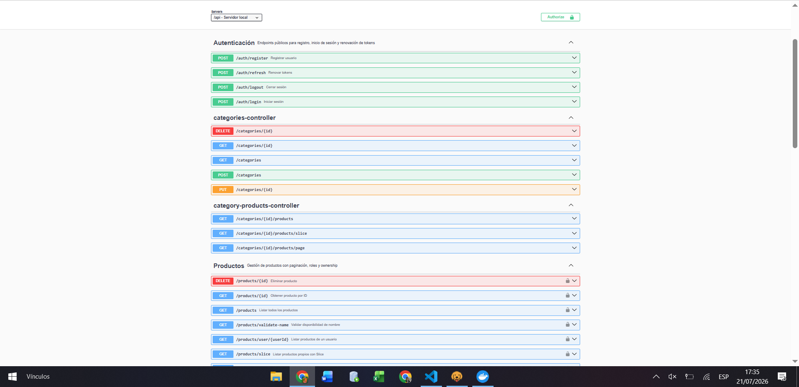
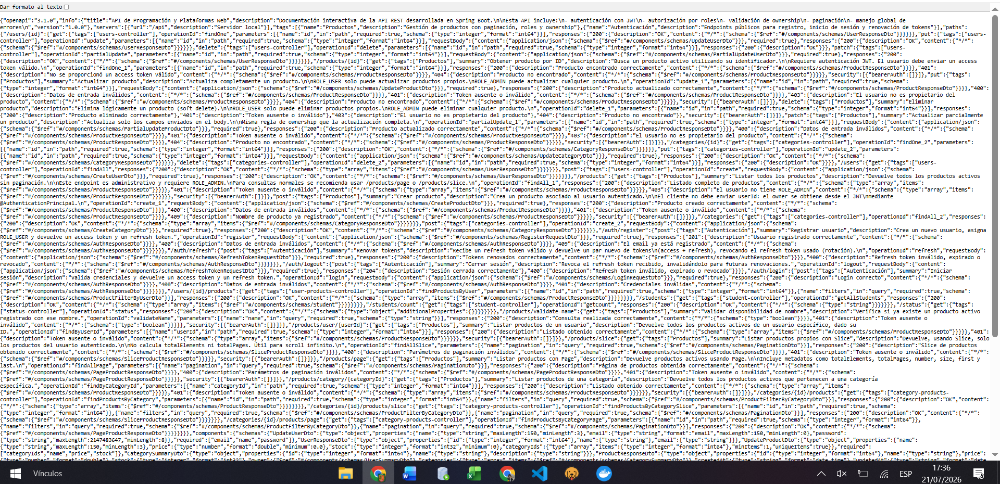
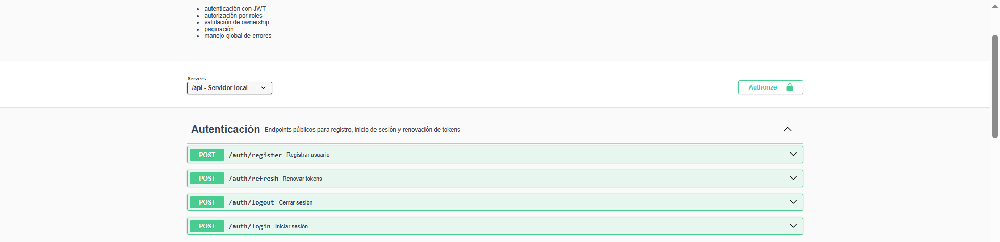
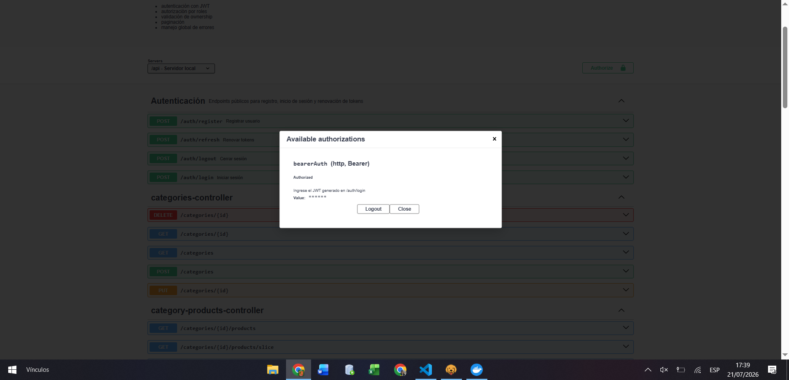
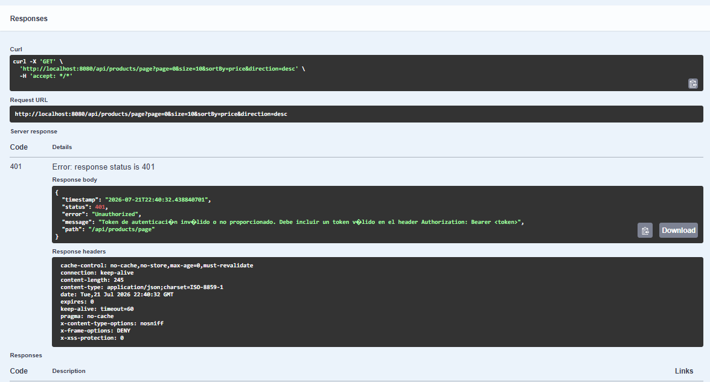
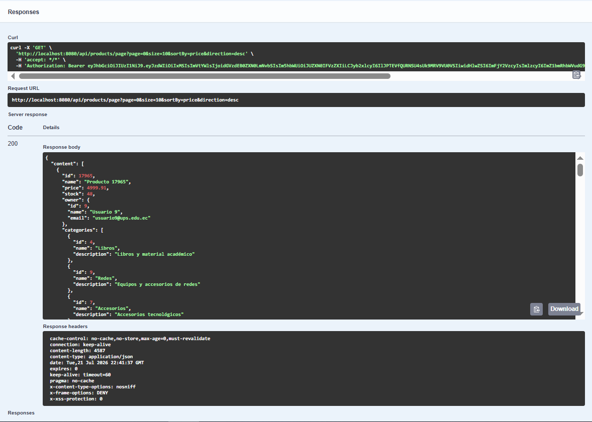
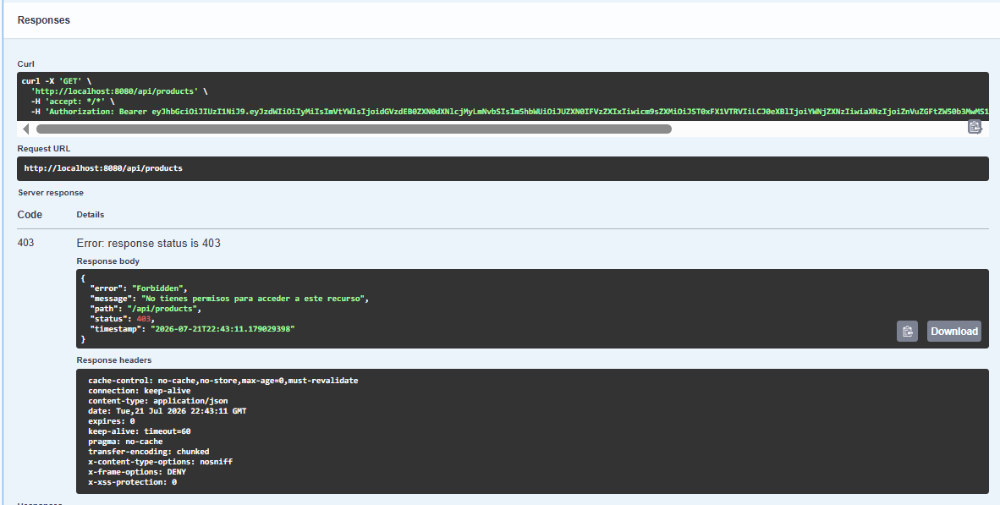

# Práctica 15: Documentación de API con Swagger y OpenAPI

## 1. Tema

Frameworks Backend: Spring Boot – Documentación interactiva de endpoints con Swagger UI, OpenAPI y seguridad JWT.

Hasta este punto, la API ya cuenta con CRUD completo, autenticación JWT, autorización por roles, ownership y refresh tokens. Sin embargo, no existía ninguna documentación interactiva: para saber qué endpoints existían, qué parámetros recibían o qué respuestas podían devolver, había que revisar el código directamente o depender de una colección de Bruno mantenida a mano. En esta práctica se integró **Swagger UI** mediante **springdoc-openapi**, generando documentación automática y navegable directamente desde el backend.

---

## 2. Objetivo

- Exponer una interfaz interactiva (Swagger UI) donde se puedan ver y probar todos los endpoints de la API.
- Documentar cada endpoint con su propósito, parámetros y posibles códigos de respuesta.
- Permitir probar endpoints protegidos por JWT directamente desde Swagger, usando el botón **Authorize**.
- Mantener Swagger UI público en desarrollo, sin debilitar la seguridad de los endpoints reales (que siguen exigiendo JWT).

---

## 3. Dependencia agregada

Archivo: `build.gradle.kts`

```kotlin
dependencies {
    // ...

    implementation("org.springdoc:springdoc-openapi-starter-webmvc-ui:3.0.3")
}
```

---

## 4. Rutas de acceso

Con `context-path: /api` configurado en el proyecto:

| Recurso | Ruta |
|---------|------|
| Swagger UI | `http://localhost:8080/api/swagger-ui/index.html` |
| JSON OpenAPI | `http://localhost:8080/api/v3/api-docs` |

---

## 5. Permitir Swagger públicamente en `SecurityConfig`

Como el proyecto ya usa `.anyRequest().authenticated()`, Swagger quedaba bloqueado por defecto. Se agregó una regla explícita:

```java
.authorizeHttpRequests(auth -> auth
        .requestMatchers("/auth/**").permitAll()
        .requestMatchers("/status/**").permitAll()
        .requestMatchers("/actuator/**").permitAll()

        .requestMatchers(
                "/swagger-ui/**",
                "/swagger-ui.html",
                "/v3/api-docs/**",
                "/v3/api-docs.yaml",
                "/swagger-resources/**",
                "/webjars/**"
        ).permitAll()

        .anyRequest().authenticated()
)
```

> **Importante:** aunque el proyecto usa `context-path: /api`, en `requestMatchers` no se escribe el prefijo `/api`, porque Spring Security evalúa las rutas internas de la aplicación, no la URL externa completa.

Con esto, Swagger UI es visible sin token, pero **los endpoints documentados siguen exigiendo JWT** igual que antes — Swagger solo describe la API, no cambia sus reglas de seguridad.

---

## 6. `OpenApiConfig`

Archivo: `security/config/OpenApiConfig.java`

Se creó una configuración que personaliza:

- Título, versión y descripción general de la API.
- El servidor base (`/api`, para que Swagger construya las rutas correctamente).
- Un esquema de seguridad `bearerAuth` (tipo HTTP Bearer, formato JWT), que habilita el botón **Authorize** en Swagger UI.

```java
public static final String SECURITY_SCHEME_NAME = "bearerAuth";
```

Este nombre se reutiliza luego en `@SecurityRequirement(name = OpenApiConfig.SECURITY_SCHEME_NAME)` sobre los controladores protegidos.

---

## 7. Documentación por controlador

### 7.1. `AuthController`
Se agregó `@Tag(name = "Autenticación")` a nivel de clase, y `@Operation` + `@ApiResponses` en cada uno de los 4 endpoints (`login`, `register`, `refresh`, `logout`). **No** se usó `@SecurityRequirement` a nivel de clase, porque ninguno de estos endpoints exige un access token: se validan con credenciales o con un refresh token en el body, no con el header `Authorization`.

### 7.2. `ProductsController`
Se agregó `@Tag(name = "Productos")` y `@SecurityRequirement(name = OpenApiConfig.SECURITY_SCHEME_NAME)` a nivel de clase, ya que todos sus endpoints requieren JWT. Cada método (`findAll`, `findAllPage`, `findAllSlice`, `findOne`, `create`, `update`, `partialUpdate`, `delete`, `findByUserId`, `findByCategoryId`, `validateName`) quedó documentado con `@Operation` (resumen y descripción) y `@ApiResponses` (los códigos HTTP que puede devolver, incluyendo `401`, `403` y `404` según corresponda a cada regla de negocio ya implementada en prácticas anteriores).

---

## 8. Documentación de DTOs con `@Schema`

Se documentaron los DTOs de entrada más usados, agregando descripciones y ejemplos por campo:

- `LoginRequestDto` (`email`, `password`)
- `RegisterRequestDto` (`name`, `email`, `password`)
- `PaginationDto` (`page`, `size`, `sortBy`, `direction`)

Ejemplo:

```java
@Schema(description = "Correo del usuario", example = "usera@ups.edu.ec")
@NotBlank(message = "El email es obligatorio")
@Email(message = "Debe ingresar un email válido")
private String email;
```

Esto hace que Swagger muestre, junto a cada campo del formulario, un ejemplo de valor esperado, facilitando probar los endpoints sin adivinar el formato.

---

## 9. Configuración adicional en `application.yaml`

```yaml
springdoc:
  api-docs:
    path: /v3/api-docs
  swagger-ui:
    path: /swagger-ui.html
    operations-sorter: method
    tags-sorter: alpha
    try-it-out-enabled: true
```

| Propiedad | Efecto |
|-----------|--------|
| `operations-sorter: method` | Ordena los endpoints de cada tag por método HTTP |
| `tags-sorter: alpha` | Ordena los tags alfabéticamente |
| `try-it-out-enabled: true` | Habilita el botón "Try it out" en todos los endpoints por defecto |

---

## 10. Pruebas realizadas (Swagger UI)

| # | Escenario | Resultado esperado | Resultado obtenido |
|---|-----------|----------------------|----------------------|
| 1 | Cargar Swagger UI | Se ven los grupos "Autenticación" y "Productos" | ✅ |
| 2 | Consultar el JSON OpenAPI | Documento válido con `openapi`, `info`, `paths` | ✅ |
| 3 | Revisar `AuthController` documentado | Endpoints con descripciones claras | ✅ |
| 4 | Botón Authorize | Modal con esquema `bearerAuth` para pegar el JWT | ✅ |
| 5 | `GET /products/page` sin token | `401 Unauthorized` | ✅ |
| 6 | `GET /products/page` con token | `200 OK` | ✅ |
| 7 | `GET /products` con `ROLE_USER` | `403 Forbidden` | ✅ |









> El caso complementario (`GET /products` con `ROLE_ADMIN` → `200 OK`) ya había quedado evidenciado en la Práctica 12, al implementar `@PreAuthorize("hasRole('ADMIN')")` sobre ese mismo endpoint.

---

## 11. Preguntas de la actividad

**¿Cuál es la diferencia entre Swagger UI y OpenAPI?**

OpenAPI es una especificación estándar (un formato JSON o YAML) para describir una API REST: sus rutas, métodos, parámetros, cuerpos de petición y respuesta, y esquemas de seguridad. Swagger UI, en cambio, es la interfaz visual que **lee** esa especificación OpenAPI y la presenta de forma interactiva, permitiendo explorar y probar los endpoints desde el navegador. En este proyecto, `springdoc-openapi` genera automáticamente el documento OpenAPI a partir del código (controladores, DTOs, anotaciones), y Swagger UI lo consume para mostrar la documentación navegable.

**¿Por qué Swagger puede ser público pero los endpoints seguir protegidos?**

Porque son dos cosas independientes en `SecurityConfig`: permitir el acceso a `/swagger-ui/**` y `/v3/api-docs/**` solo hace visible la **documentación** de la API (el catálogo de endpoints y su descripción), no otorga acceso a los datos reales. Cada endpoint documentado sigue teniendo sus propias reglas (`.anyRequest().authenticated()`, `@PreAuthorize`, validación de ownership), evaluadas exactamente igual que si se llamara desde Bruno o cualquier otro cliente. Swagger UI simplemente arma la petición HTTP por ti; el backend la trata como cualquier otra.

**¿Cómo se configura Swagger para enviar un JWT en `Authorization: Bearer`?**

Se define un esquema de seguridad tipo HTTP Bearer en `OpenApiConfig` (`SecurityScheme.Type.HTTP`, `scheme("bearer")`, `bearerFormat("JWT")`), registrado con el nombre `bearerAuth`. Ese nombre se referencia luego con `@SecurityRequirement(name = "bearerAuth")` en los controladores que requieren autenticación (como `ProductsController`). Esto hace que Swagger UI muestre el botón **Authorize**: al pegar ahí un token JWT válido, Swagger lo guarda y lo adjunta automáticamente como header `Authorization: Bearer <token>` en cada petición que se pruebe desde la interfaz, sin tener que copiarlo manualmente en cada endpoint.

---

