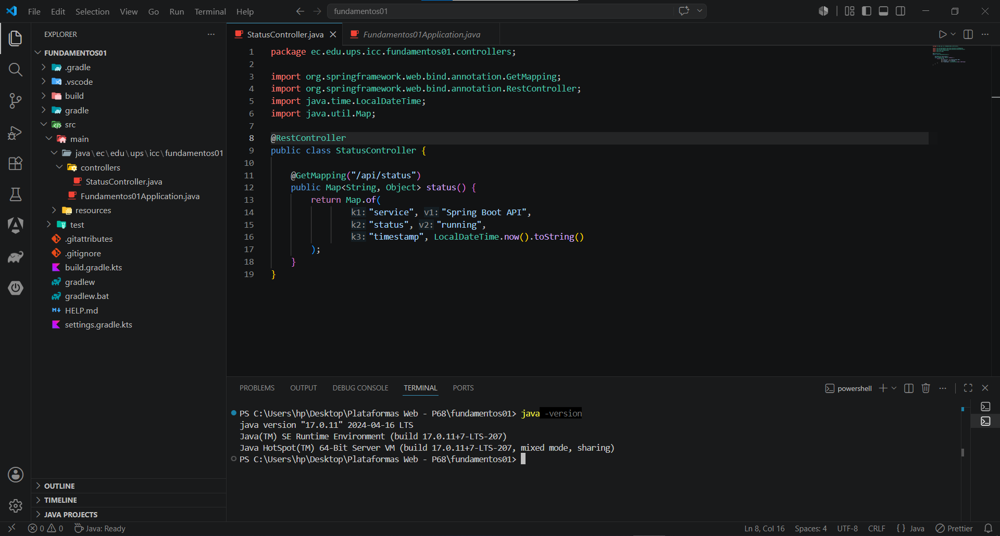
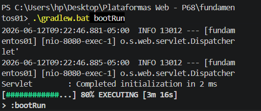
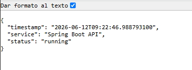
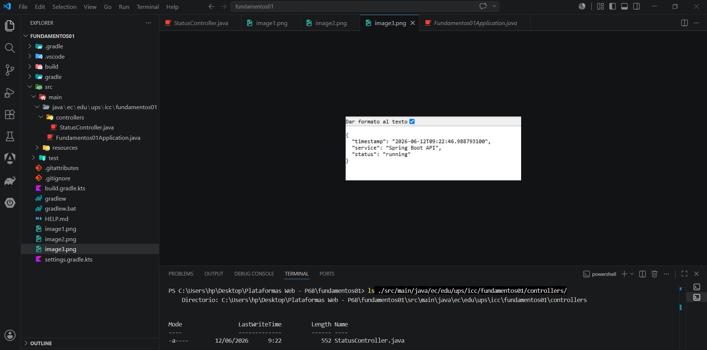

## 1. Verificación de Java

Se verificó correctamente la instalación de Java mediante el siguiente comando:

```bash
java -version
```

## Resultado obtenido:

```text
java version "17.0.11" 2024-04-16 LTS
Java(TM) SE Runtime Environment (build 17.0.11+7-LTS-207)
Java HotSpot(TM) 64-Bit Server VM (build 17.0.11+7-LTS-207, mixed mode, sharing)
```



---

## 2. Ejecución del servidor Spring Boot

Se ejecutó la aplicación utilizando Gradle mediante el comando:

```bash
.\gradlew.bat bootRun
```

La consola mostró el inicio correcto del servidor Spring Boot y Tomcat.



---

## 3. Endpoint `/api/status` funcionando

Se probó el endpoint desarrollado para verificar el estado de la API.

URL utilizada:
text
http://localhost:8080/api/status


Respuesta obtenida:


{
  "service": "Spring Boot API",
  "status": "running",
  "timestamp": "2026-06-12T09:16:00"
}
```
```




---

## 4. Verificación del controlador creado

Se verificó la existencia del controlador mediante el comando:

```bash
ls ./src/main/java/ec/edu/ups/icc/fundamentos01/controllers/
```

Resultado esperado:

```text
StatusController.java
```



---

## 5. Explicación

Durante esta práctica aprendí que Spring Boot permite crear aplicaciones web y APIs REST de manera rápida mediante una estructura organizada basada en controladores, servicios y configuraciones automáticas.

El endpoint `/api/status` funciona gracias al controlador `StatusController`, el cual recibe solicitudes HTTP GET y devuelve una respuesta en formato JSON. Esto permite exponer información de la aplicación a través de una URL accesible desde el navegador o herramientas como Postman.

También comprendí que Spring Boot incorpora un servidor web embebido llamado Tomcat, lo que permite ejecutar la aplicación sin necesidad de instalar un servidor externo. Gracias a esto es posible desarrollar y probar APIs de forma sencilla y eficiente.

La práctica permitió entender la estructura básica de un proyecto Spring Boot y el proceso para crear endpoints REST utilizando anotaciones como `@RestController` y `@GetMapping`.


